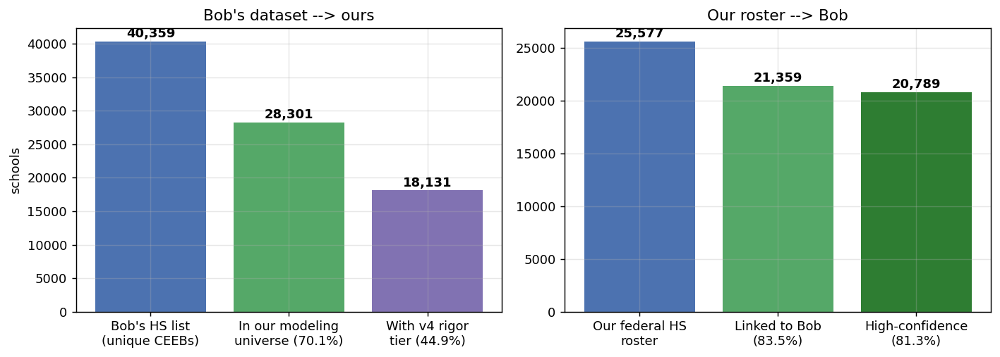
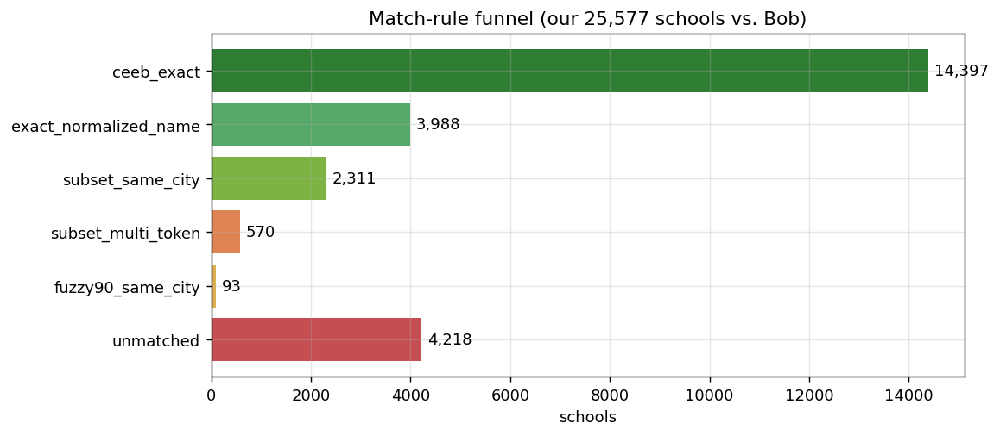
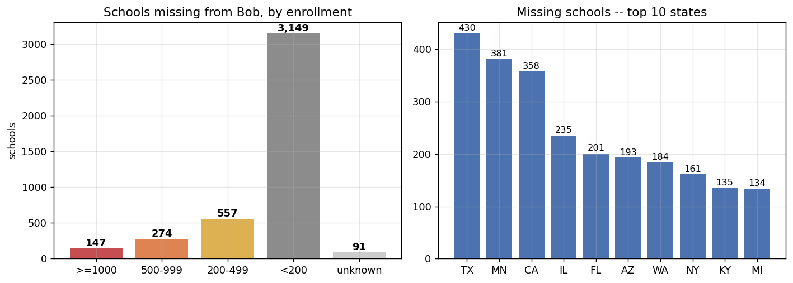

# Coverage Report: Federal School Roster vs. the NU Master List

Date: 2026-07-27 · Artifacts: `csv_exports/nu_list_name_crosswalk_2026-07-27.csv` (full correspondence table), `csv_exports/nu_list_missing_schools_2026-07-27.csv` (gap list)

## 1. Headline coverage

After the full matching pipeline (CEEB linkage + name-variant rules + geographic audit), the two datasets align as follows:

**the NU master list → ours.** Of the 40,359 unique high schools (by CEEB) in the NU org export, 28,301 (**70.1%**) appear in our federally-anchored modeling universe, and 18,131 (**44.9%**) carry a v4 rigor tier. The 30% that do not enter the universe are dominated by adult schools, vocational/training centers, credit-recovery and independent-study programs, and closed schools — only 2.8% of them were ever visited by NU and only 16% carry any NU analytics, i.e., they are largely dormant entries rather than active recruiting targets.

**Our roster → the NU master list.** Of our 25,577 verified public and private high schools (grades 9–12, enrollment ≥ 30), 21,359 (**83.5%**) link to a NU-list record — 20,789 (**81.3%**) at high confidence — leaving 4,218 (**16.5%**) genuinely absent from the NU master list.

## 2. Metric definitions

| Metric | Definition |
|---|---|
| Modeling universe | Public + private high schools serving grades 9–12 with enrollment ≥ 30, after removing colleges, closed schools, and non-school organizations |
| v4 rigor tier | Five-tier curricular-rigor classification (qualifying-density AP metric + verified IB), covering schools with ≥ 1 scoring component |
| High-confidence match | CEEB-exact, exact normalized name, name-subset with same city, or fuzzy ≥ 90 with same city |
| Review-tier match | Name-subset without city confirmation (570 rows) — usable but flagged for spot-checking |
| Missing school | A school in our federal roster with no NU-list record under any rule |

## 3. Matching methodology

Matching proceeds through a five-tier funnel; every school receives an auditable rule label:

1. **`ceeb_exact` (14,397).** The school's adjudicated CEEB code appears in the NU master list. CEEBs come from the NCES↔CEEB junction after LLM adjudication of all review-tier pairs.
2. **`exact_normalized_name` (3,988).** Token-normalized names match exactly within the state. Normalization strips generic words (High/School/HS/SHS/"H S"/Senior/Junior/Secondary), expands abbreviations (Twp→Township, St→Saint, Sec→Secondary, Ft→Fort…), drops middle initials, and repairs the NU master list's ~30-character name truncation (e.g., "…Johnso" → "Johnson") when the cut token uniquely prefixes one of ours.
3. **`subset_same_city` (2,311).** One name's distinctive tokens are a subset of the other's and the cities agree — this captures district prefixes ("Alief Hastings" ↔ "Hastings") and person-name prefixes ("Patricia E Paetow" ↔ "Paetow", "James W Robinson Jr Sec School" ↔ "Robinson Secondary").
4. **`fuzzy90_same_city` (93).** Token-set similarity ≥ 90 with the same city — catches misspellings and punctuation variants.
5. **`subset_multi_token` (570, review).** Subset match without city confirmation; kept but flagged, since spot-checks found occasional false pairs.

A **geographic audit** validates the pipeline: for 15,263 matched public schools with coordinates in both datasets, the median NU-vs-NCES coordinate discrepancy is **1.0 km** and 94.3% lie within 10 km. The 364 pairs more than 50 km apart form a standing QA list of suspect matches (overlapping the CEEB digit-corruption issue documented in the EDA report).

## 4. The 4,218 schools missing from the NU master list

**Composition.** 3,979 public / 239 private; 147 schools with ≥ 1,000 students and 274 more with 500–999; 3,149 under 200 students. Texas (430), Minnesota (381), and California (358) lead. The list includes **41 IB schools**, and 820 rows already carry a v4 rigor tier — the admissions team can triage them immediately.

**Why they are missing — three causes, in order of importance:**

1. **A 2000s-cohort blind spot (confirmed).** Geographic audit of the largest missing schools proved five mega-schools (2,861–4,291 students) genuinely absent while their same-district neighbors are present: John A. Ferguson (Miami, opened 2003), Timber Creek (Orlando, 2001), Newsome (Lithia FL, 2003), Cherokee Trail (Aurora CO, 2003), Cypress Ridge (Houston, 2002). All opened in the early-2000s suburban construction wave — the NU master list appears never to have systematically back-filled that cohort.
2. **Small, rural, and newly opened schools (the long tail).** Median enrollment on the missing list is 39; these schools sit outside NU's historical recruiting footprint, so no one ever created records for them.
3. **Non-traditional formats.** Virtual academies, alternative programs, and micro-charters that issue diplomas but rarely interact with selective admissions.

Two rows are annotated `likely_in_nu_list_manual_review` (Johnson HS San Antonio ↔ "Claudia Taylor Ladybird Johnso[n]"; NV Learning Academy ↔ a co-located "Academy Individualized Study") — cases our conservative rules deliberately decline to auto-accept.

## 5. Recommendations

1. Feed `nu_list_name_crosswalk` into the pipeline's org join to replace pure-CEEB linkage (+6,962 links available immediately).
2. Hand the admissions team the missing-schools list sorted by enrollment: the 421 schools ≥ 500 students are direct recruiting-visibility additions; the long tail evidences platform completeness.
3. Investigate the five confirmed 2000s-cohort absences at the source system — if the ingest cutoff is real, more of that cohort is silently missing beyond our federal roster's reach.
4. Work the 364-pair geo-discrepancy QA list together with the CEEB digit-shift corruption flags.
